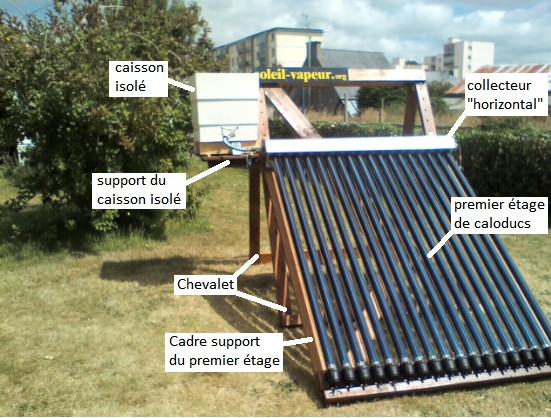
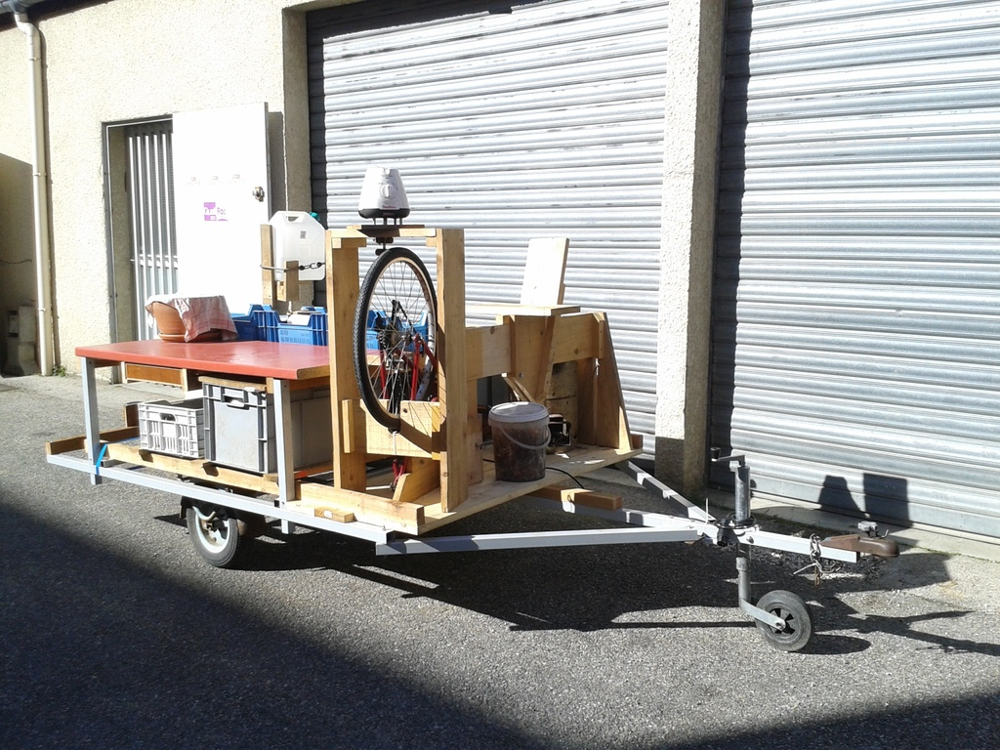
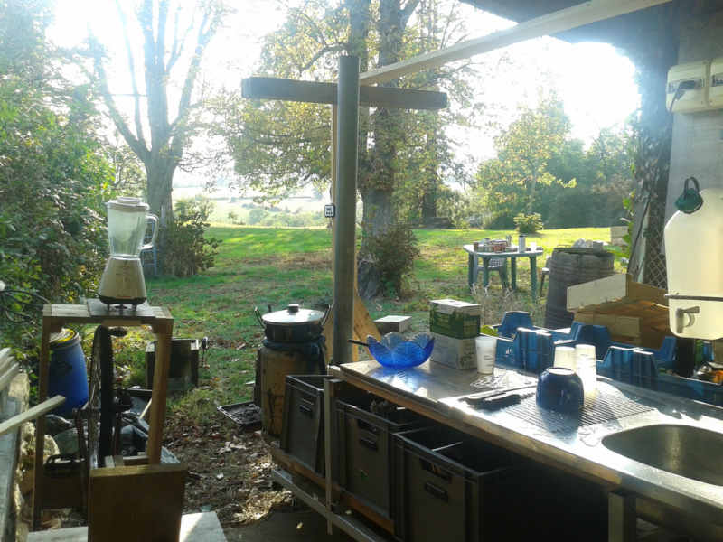
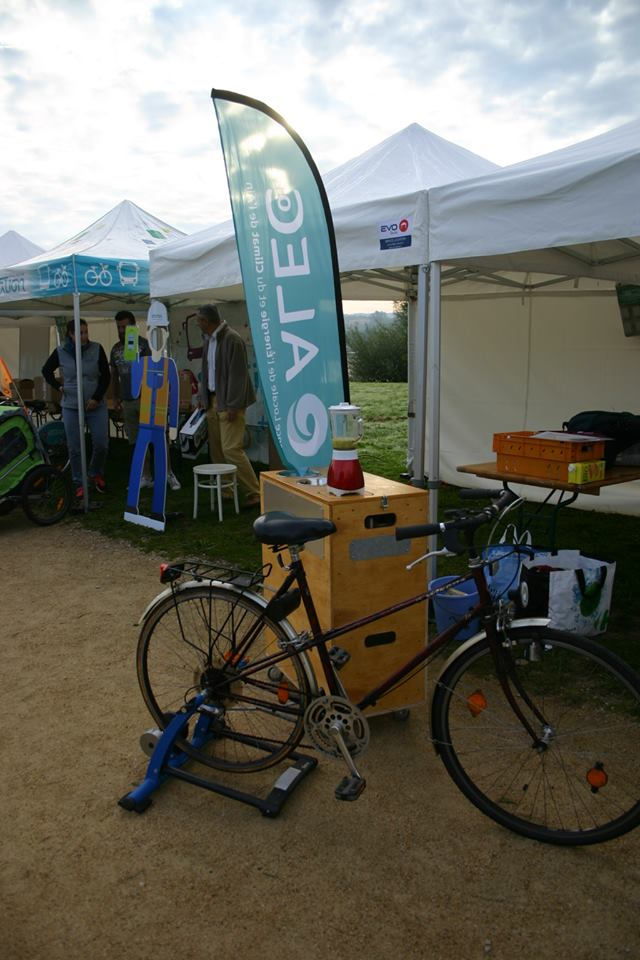
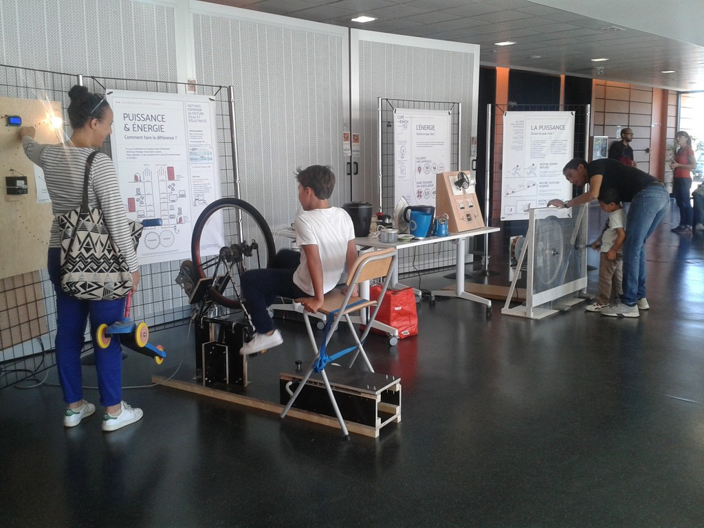
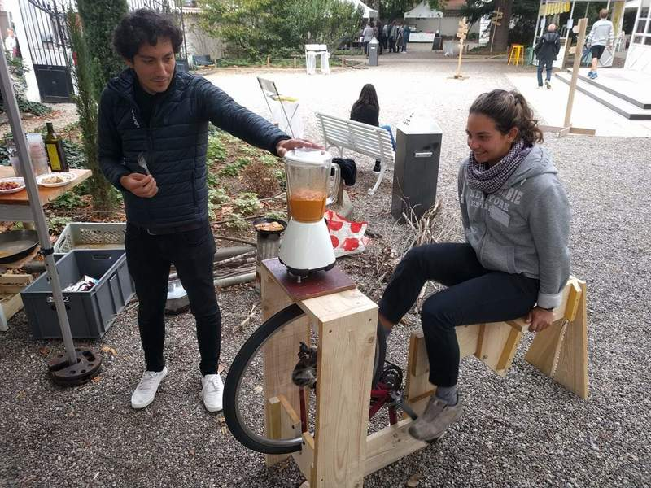
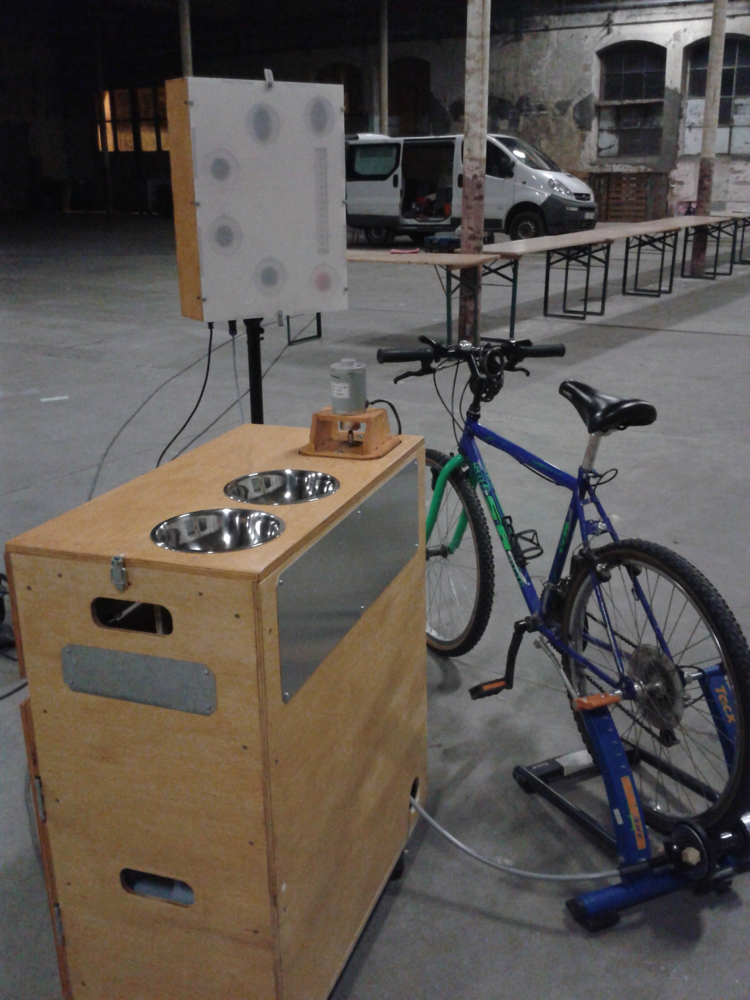
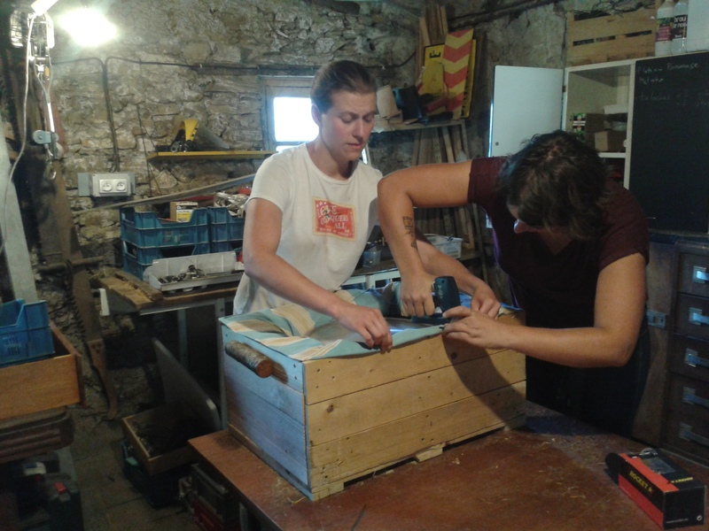
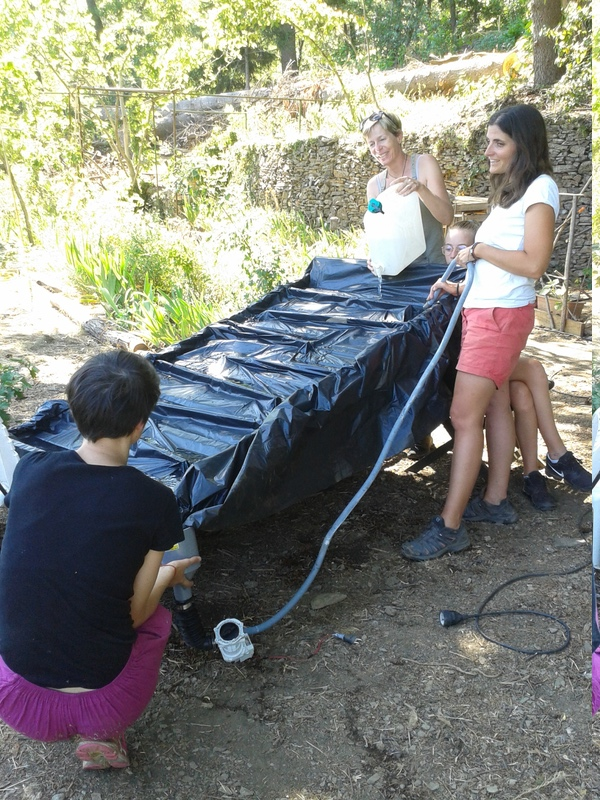

> **Se réapproprier l’usage des technologies avec les questions d'énergies & de ressources en s’appuyant sur l'approche de la sobriété des low-tech.**

**Emmanuel LAURENT** 
Ingénieur physicien de formation et docteur en instrumentation micro-optique. Mon activité actuelle tourne autour de l’ingénierie et le design de low-tech avec l'idée de fiabiliser ces techniques et de les rendre utilisables régulièrement. Je pratique en atelier-laboratoire le développement de ces technologies sobres en m’appuyant sur des pratiques coopératives de tiers-lieux et sur mes connaissances en physique. Ces activités me permettent de développer, puis de transmettre, des pratiques d'ingénierie collaborative, de constitution d'un savoir commun et d'écriture de documentations.

* [Mon approche du développement de technologies sobres (low-tech)](https://pad.lamyne.org/low-tech_intentions_vers_terrains) - réflexions en cours.
* Voir également la note de la Fabrique Ecologique ["Vers des technologies sobres et résilientes – Pourquoi et comment développer l’innovation « low-tech » ?"](https://www.lafabriqueecologique.fr/vers-des-technologies-sobres-et-resilientes-pourquoi-et-comment-developper-linnovation-low-tech/) qui pose un cadre complémentaire.

# Mes axes de travail

## A/ Pratiques des tiers-lieux appliquées au développement de technologies sobres

* Impliqué dans la communauté de [la Myne](https://lamyne.org) - tiers-lieu à Lyon - mes contributions sont la co-animation du Conseil Collégial, des apports sur la documentation, la participation à la conciergerie,...
* Pour vous aider à comprendre ce qu'est la Myne: [en historique](http://movilab.org/index.php?title=La_MYNE), [en vidéo](https://videos.lescommuns.org/videos/embed/a7fe81c1-f4f5-4841-81c3-7d34b717044f) (en 3 min), [en audio](https://lamyne.bandcamp.com/album/rapport-dactivit-audio-2019) (40min. - rapport d'activité 2019)
* Dans ce laboratoire citoyen, j'ai initié des [activités low-tech](https://pad.lamyne.org/labolowtech-annuaire#) 

> Ces pratiques collaboratives peuvent bénéficier au développement des low-tech: **[mon intention](intention_pratiques_collaboratives.md)** - réflexions en cours à mettre à jours.

### Savoirs communs
* Bibliographie et pratiques de documentation en tiers-lieux (en cours de formalisation)

### Ingénierie collaborative & distribuée
* Basée sur les pratiques de la Myne et d'autres écosystèmes en tiers-lieux 
> Application sur une [cuisinière solaire à base de caloducs](https://soleil-vapeur.org/5-sommaires-et-pdf/caloducs.pdf) 
Développée entre 2015 et 2019 par le [collectif soleil-vapeur](https://soleil-vapeur.org/). En cours de reprise et d'amélioration en 2022-23. 

> Application sur un concentrateur solaire open-source & low-tech 
[Vue d'ensemble](https://movilab.org/wiki/Concentrateur_solaire) et [documentation des actions en cours](https://pad.lamyne.org/solarOSE2#)

## B/ Expérimentations en labo & sur le terrain

### Appropriation collective de low-tech
> * **[Cuisine low-tech](https://pad.lamyne.org/cuisine_low-tech_mobile#) et [sa transposition mobile](https://pad.lamyne.org/cuisine_conviviale#)** 
> * **Conserverie alimentaire low-tech** : [session d'expérimentation en sept. - oct 2020](https://movilab.org/wiki/Low-tech_Camp)

 

### Programme de recherche Visiblenergie

**Rendre la production et l'utilisation des énergies renouvelables ludique, visible et pratique** - 2016-2019
  * Des vélos mixeur
  * Des vélos générateur d'énergie
  * [Des compteurs connectés](https://pad.lamyne.org/887uJqRdSqi_RCNRyx97GA#)
  * [Contribution à la Biennale du Design 2017](biennale_design2017.md)

 

 

## C/ Transmission & formation

>
> **[Pour avoir une vue large de mes activités de transmission](interventions.md)**
>

  * **Formation**
    * **INSA-Lyon** - Accompagnement de groupes d'étudiants sur des modèles d'usages de technologies low-tech - année 2022-23
    * **[PISTE-INPG](https://ense3.grenoble-inp.fr/fr/formation/piste)** - Pour une Ingénierie Sobre Techno et Eco-responsable - Formation aux enjeux Communs, OpenSource et low-tech - 2021, 2022 et 2023 
    * **Universités de Technologies** - Formation d'une équipe pédagogique des UTs au rapport Low-tech & Communs - 2022 
    * INSA-Lyon: **[PASTECH (PAradigmes, Sociétés, TECHnologies)](https://pad.lamyne.org/pastech_2018_19)**: des groupes d'étudiants étudient la trajectoire historique d’un système technique en intégrant les dimensions sociétales puis [publier une synthèse sur un wiki](https://fr.wikiversity.org/wiki/Recherche:Pastech). Formation aux notions de low-tech, d'open-source, de communs et accompagnement à la rédaction wiki avec des enseignants de l'INSA-Lyon - 2019-22
    * Ecole des Mines de Saint-Etienne - [Facilitateur durant des Hackathons](dynamo_days_mines_sainte.md) de 2018 à 2020
  
  * **S-MART Academy**
    * Accompagnement au développement de la **plate-forme de partage de supports de formation** [S-MART Academy](https://s-mart.fr/academy/)
  
  * **Tables rondes**
    * Journées des Savoirs Engagés et Reliés [JESER](https://www.mouvement-ser.org/programme/) à Lyon en 2022 et la [documentation des échanges](https://pad.lescommuns.org/doc_JESER2022#)
    * INSA-Lyon - [Journées SDAD 2023](https://mailchi.mp/ef03c09e526d/semaine-des-alternatives-durables-2023)
    * [Forum des Usages Coopératifs de Brest](https://forum-usages-cooperatifs.net/?LesLowtech) 2022 - Sessions Low-tech avec sa [prise de notes](https://pad.lamyne.org/FUC22_low-tech_mercredi)
 
  * **[Etika Mondo](https://etikamondo.com/)** - Formateur en low-tech (théorie & initiation à la pratique) de 250 personnes - sur 2 mois à l'été 2019
    * [Machine à laver à pédales](https://pad.lamyne.org/PjxgCj5FTn2hVtwWKuhQfA#) - atelier d'initiation
    * [Marmitte norvégienne](https://pad.lamyne.org/marmite_norvegienne_tuto) 
    * Cuiseur solaire parabolique
    * ...
   

 

# Ecosystèmes en lien
  * [La Myne](https://www.lamyne.org/): mon terrain de jeu principal :-)
  * [INSA Lyon](https://www.insa-lyon.fr/)
  * [Communecter](https://www.communecter.org/#): réseau social libre.
  * [Oxamyne](https://www.oxamyne.org/): coopérative d'entrepreneurs travaillant dans l’hybridation des savoirs-faire et une contribution aux communs.
  
# Des besoins

* Création en cours d'un **laboratoire d'expérimentation de technologies sobres** à la Myne >> recherche de partenaires et de contributeurs

# Pour me contacter ou suivre mes activités

 -  - 

