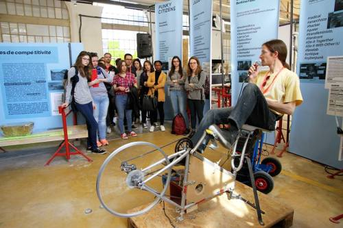
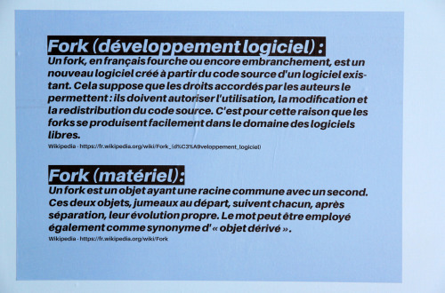
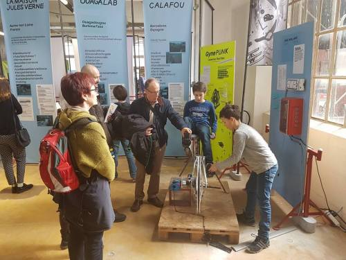
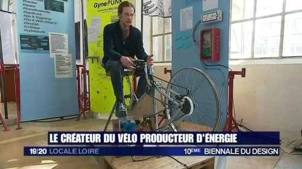
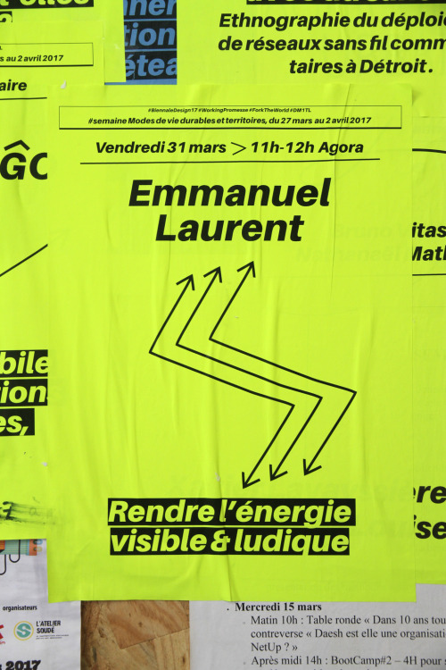
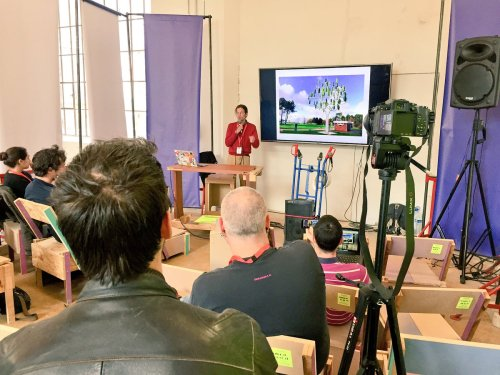
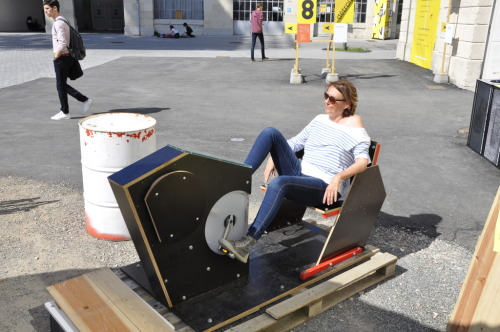

Comme contributeur des Tiers-Lieux de la Myne (Lyon) et d'Openfactory (Saint-Etienne), j'ai été invité sur l'exposition **[“l'expérience Tiers-Lieux” de la Biennale du Design](https://www.biennale-design.com/saint-etienne/2017/fr/programme/?ev=l-experience-tiers-lieux-14)** sur de la micro-production d'énergie pour illustrer les pratiques du fork et du hack.

Tiers-lieux, fork, contributeur, hack ? Si ces notions vous sont peu familières, l'exposition avait pour objectif de les démystifier et de les mettre en pratique avec les visiteurs durant 4 semaines. [Un article sur Makery donne un aperçu de cette exposition](http://www.makery.info/2017/03/21/a-la-biennale-de-saint-etienne-le-travail-nest-plus-ce-quil-etait/) ainsi que de l'ensemble de la biennale.

J'ai exposé **“Energy by drill”, un générateur d'énergie à pédales** fabriqué principalement à partir de pièces détournées de leur usage initial : une visseuse sans fil comme générateur, un axe à partir d'une clé allen, un siège de bureau. Même le cadre de vélo n'est pas utilisé de manière conventionnelle, grâce au travail de David Kuhn. Le #fork, c'est cela!

Photo Sylvia Fredriksson

Photo Sylvia Fredriksson

Photo Auteur Inconnu

“Energy by drill” a été largement utilisé par les visiteurs pour allumer des lampes suivant la puissance produite. Une partie des éléments de ce système électronique (les boîtiers, relais, alimentation, …) provenait d'un tas de déchets issus des travaux du bâtiment de l'exposition. #upcycling

[Un court interview sur France 3 montre le fonctionnement.](https://vimeo.com/214573142)

L'exposition “l'expérience tiers-lieux” était très dynamique avec plusieurs workshop et des conférences tous les jours dans l'agora. J'ai pu y présenter la démarche Visible Energie, [reprise sous forme d'un storify](https://wakelet.com/wake/9c36ec43-d04c-488a-af9e-170de862af5e) (merci Nicolas Loubet !).

Photo Sylvia Fredriksson

Photo Nicolas Loubet

Celle-ci a été l'occasion de faire le lien avec d'autres réalisations de mobiliers urbains rendant visible la micro-production d'énergie, dont certains mobiliers étaient présentés sur la TAZ (Zone Autonome Temporaire) devant le fablab Openfactory.

Photo Delphine Duriaux

La Cité du Design a également accueillit un temps de rencontre et d'échanges sur les [modes de gouvernance de la transition énergétique](http://www.mediaterre.org/actu,20170410090708,2.html). En plus d'intervenir sur cette rencontre pour présenter une nouvelle fois ma démarche, j'ai insisté sur la nécessité de rendre accessible les connaissances liées à la micro-production d'énergie avec l'approche maker & fork. [Un storify reprend les éléments de l'ensemble des interventions.](https://wakelet.com/wake/9c36ec43-d04c-488a-af9e-170de862af5e).

A Openfactory et sur la TAZ, durant une quinzaine de jours, j'ai pu poursuivre un travail sur un nouveau prototype de mobilier. Dans l'objectif de rendre visible et ludique la production d'énergie, **“spinning light”** est un affichage lumineux low-tech qui nécessite de pédaler pour activer la mécanique de l'afficheur ainsi que pour générer l'énergie électrique nécessaire. Ce mobilier sera présenté plus en détails au cours de son prototypage.

Photo Auteur Inconnu

Photo Emmanuel Laurent
